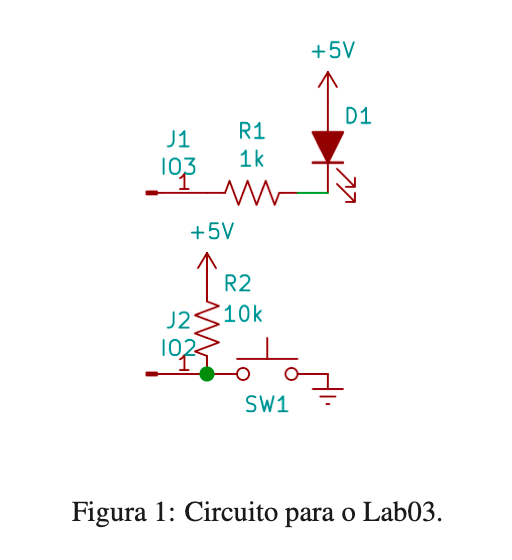
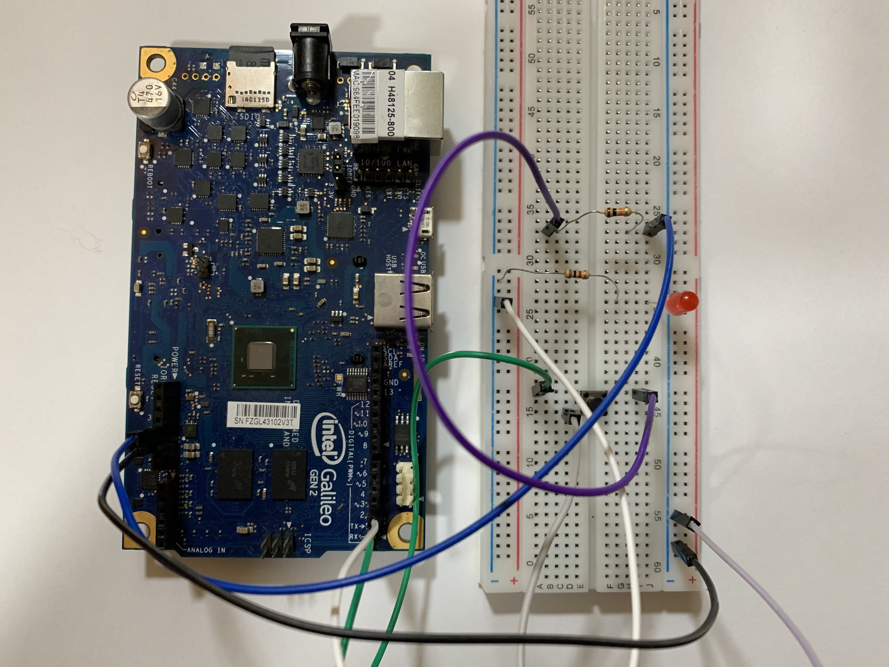

# ENG10032 Micro controllers

This repository idea is to centralize my journey through the labs from `ENG10032 Microcontrollers` course from `Federal University of Rio Grande do Sul`. All my knowledge through this path could be found at `lab.org` file using **Portuguese**.

## LAB 01

- Enviroment set up

## LAB 02

- Cross compiler and hello world!

## LAB 03

- GPIO and blinking LEDs

## LAB 04

- Call `Assembly` functions in C programs.

### License

MIT License. [Click here for more information.](LICENSE)
